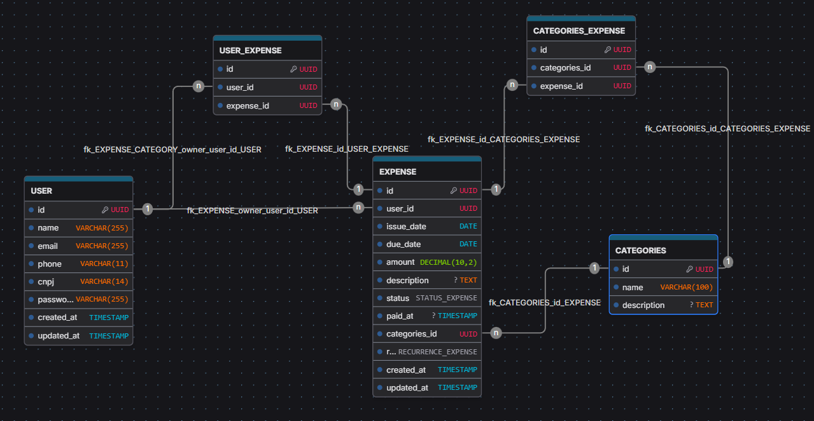
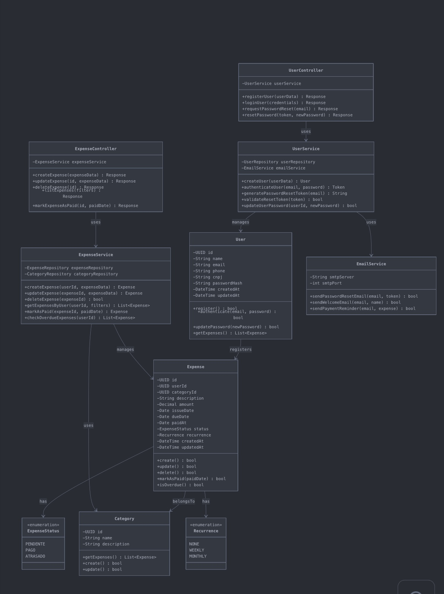

# FIIM

## Diagramas

### Introdução

Esta página serve como a fonte central de verdade para todos os diagramas técnicos e de processos relacionados ao **FIIM**.

## 1. Modelo Entidade-Relacionamento

Modelo Entidade-Relacionamento (MER) que representará a estrutura conceitual do nosso banco de dados, as principais entidades e seus relacionamentos. 

### Principais entidades:

- Usuário: Armazena informações dos usuários
- Despesa: Armazena informações de despesas
- Categoria: Contém as categorias disponíveis na aplicação

### 1. USUÁRIO

- **Descrição:** Representa o microempreendedor ou autônomo que utilizará o sistema. É a entidade central, dona das informações financeiras.
- **Atributos:**
    - **ID** (Identificador): Um código único para cada usuário.
    - **Name**: Nome completo do usuário.
    - **Email**: Endereço de e-mail, que será usado para login e comunicação.
    - **PasswordHash**: A senha do usuário, armazenada de forma segura (criptografada).
    - **CNPJ**: O Cadastro Nacional da Pessoa Jurídica do MEI.
    - **Phone**: Número de contato do usuário.
    - **CreatedAt**: Data em que o cadastro foi realizado.
    - **UpdatedAt**: Data em que o cadastro foi alterado

### 2. DESPESA

- **Descrição:** Representa um registro de gasto ou uma conta a pagar lançada pelo usuário.
- **Atributos:**
    - **ID** (Identificador): Um código único para cada registro de despesa.
    - **Description**: Um texto breve explicando do que se trata a despesa.
    - **Amount**: O montante financeiro da despesa.
    - **Issue_date**: Data da competência do pagamento
    - **Due_date**: A data limite para o pagamento da despesa.
    - **PaidAt**: A data em que a despesa foi efetivamente paga (pode ser nula se estiver pendente).
    - **Status**: A situação atual da despesa (ex: Pendente, Pago, Atrasado).
    - **Recurrence**: A recorrência da despesa (ex: Sem recorrência, semanal ou mensal)
    - **CreatedAt**: Data em que a despesa foi registrada no sistema.
    - **UpdatedAt**: Data em que a despesa foi alterada no sistema.

### 3. CATEGORIA

- **Descrição:** A "categorização" implica em uma entidade para gerenciar as categorias de gastos. Isso torna o sistema mais robusto e flexível.
- **Atributos:**
    - **ID** (Identificador): Um código único para cada categoria.
    - **Name**: O nome da categoria (ex: "Fornecedores", "Aluguel").
    - **Description**: Uma breve explicação sobre a categoria.
  

    <image src="mer.png">

### Relacionamentos

1. **O usuário registra suas despesas**
    1. **Descrição:** Um usuário pode registrar várias despesas, mas cada despesa pertence a um único usuário.
    2. **Cardinalidade:** 1:N (Um para Muitos).
2. **A despesa é classificada em categoria**
    1. **Descrição:** Uma despesa é classificada em uma única categoria, e uma categoria pode ser usada para classificar várias despesas.
    2. **Cardinalidade:** 1:N (Um para Muitos).

## 2. Diagrama Entidade-Relacionamento

Diagrama que representa a estrutura lógica do nosso banco de dados principal, incluindo tabelas, colunas e relacionamentos (chaves primárias e estrangeiras).

### Detalhamento das Tabelas

### Tabela: USER

Armazena os dados dos microempreendedores.

- **id (UUID, PK, UNIQUE):** Chave primária.
- **name (VARCHAR(255), NOT NULL):** Nome do usuário.
- **email (VARCHAR(255), NOT NULL, UNIQUE):** E-mail para login, deve ser único.
- **phone (VARCHAR(11), NOT NULL):** Telefone do usuário, sem formatação
- **cnpj (VARCHAR(14), NOT NULL, UNIQUE):** CNPJ do MEI, sem formatação, deve ser único.
- **password_hash (VARCHAR(255), NOT NULL):** Senha após a aplicação de um algoritmo de hash (ex: bcrypt).
- **createdAt / updatedAt (TIMESTAMP):** Campos para auditoria.

### Tabela: CATEGORIES

Armazena as possíveis categorias de despesas para organização.

- **id (UUID, PK, UNIQUE):** Chave primária.
- **name (VARCHAR(100), NOT NULL, UNIQUE):** Nome único da categoria.
- **description (TEXT, NULL):** Descrição opcional.

### Tabela: EXPENSE

Armazena cada registro de despesa de um usuário.

- **id (UUID, PK, UNIQUE):** Chave primária.
- **user_id (UUID, NOT NULL, FK):** Referencia user(id). Garante que a despesa tem um "dono".
- **issue_date (DATE, NOT NULL):** Data de competência da conta
- **due_date (DATE, NOT NULL):** Data de vencimento da conta.
- **amount (DECIMAL(10, 2), NOT NULL):** Valor monetário com duas casas decimais.
- **description (TEXT, NOT NULL):** Detalhes da despesa.
- **status (ENUM, DEFAULT 'PENDENTE'):** Status da conta. É um ENUM(’PENDENTE’, ‘PAGO’, ‘ATRASADO’).
- **paid_at (DATE, NULL):** Data do pagamento. Nulo se a conta não foi paga.
- **categories_id (UUID, NOT NULL, FK):** Referencia categories(id). Garante que a despesa está categorizada.
- **recurrence (ENUM, DEFAULT 'NONE'):** Recorrência da conta. É um ENUM(’NONE’, ‘WEEKLY’, ‘MONTHLY’)
- **createdAt / updatedAt (TIMESTAMP):** Campos para auditoria.

## 3. Diagrama de Classes

Diagramas que representam as classes da aplicação, sendo elas as entidades dos bancos e seus respectivos atributos. É a representação da estrutura e relação das classes que servirão de modelo para os objetos.

## 4. Especificação de Casos de Uso (UC)

Diagramas que representam o fluxo do usuário no sistema, incluindo interações entre classes, troca de mensagens e fluxo de informações. Cada caso de uso possui objetivos, atores, pré-condições, fluxos principal/alternativos, exceções e pós-condições

### USER
### UC-01 - Cadastrar novo usuário

**Descrição:**
Caso de uso que descreve o processo de criação de uma nova conta de usuário (Empreendedor) no sistema.

**Atores:**

- Empreendedor

**Pré-condições:**

O empreendedor não deve possuir cadastro no sistema com o e-mail ou CNPJ que serão informados.

**Fluxo Principal:**

1. Empreendedor acessa a funcionalidade de cadastro.
2. Empreendedor informa os dados solicitados (Nome, E-mail, Senha, CNPJ).
3. Sistema valida os dados, verificando formato, obrigatoriedade e a unicidade do e-mail e CNPJ.
4. Sistema cria o registro do novo usuário no banco de dados.
5. Sistema exibe uma mensagem de sucesso e direciona o usuário para a tela de login.

**Pós-condições:**

O empreendedor possui uma conta ativa e pode se autenticar no sistema.

### UC-02 - Autenticar usuário

**Descrição:**
Caso de uso que descreve o processo de identificação do usuário no sistema, incluindo validação de credenciais e criação de sessão.

**Atores:**

- Empreendedor

**Pré-condições:**

O empreendedor deve possuir um cadastro ativo no sistema.

**Fluxo Principal:**

1. Empreendedor informa seu e-mail e senha.
2. Sistema valida se as credenciais correspondem a um usuário cadastrado e ativo.
3. Sistema cria uma sessão segura para o usuário.
4. Sistema concede acesso ao painel principal (dashboard).

**Pós-condições:**

O empreendedor está autenticado e com acesso às funcionalidades restritas do sistema.

### UC-03 - Recuperar senha

**Descrição:**
Caso de uso que descreve o processo de recuperação de senha do usuário, com envio de e-mail e validação de um token de redefinição com data de expiração.

**Atores:**

- Empreendedor
- Serviço de E-mail

**Pré-condições:**

O empreendedor deve ter acesso à sua conta de e-mail cadastrada no sistema.

**Fluxo Principal:**

1. Empreendedor solicita a recuperação de senha, informando seu e-mail de cadastro.
2. Sistema verifica se o e-mail existe na base de dados e gera um token de redefinição seguro e com prazo de validade.
3. Serviço de E-mail envia para o usuário um link único contendo o token para a página de atualização de senha.
4. Usuário acessa o link, informa e confirma a nova senha.
5. Sistema valida o token e, se válido, atualiza a senha do usuário.

**Pós-condições:**

A senha do empreendedor é atualizada com sucesso, invalidando a anterior.

### EXPENSES
### UC-01 - Gerenciar despesas

**Descrição:**
Caso de uso que descreve o ciclo de vida de uma despesa, incluindo seu registro, consulta, edição e remoção.

**Atores:**

- Empreendedor

**Pré-condições:**

O empreendedor deve estar autenticado no sistema.

**Fluxo Principal (Registrar Despesa):**

1. Empreendedor seleciona a opção para adicionar uma nova despesa.
2. Empreendedor preenche os dados da despesa (Descrição, Valor, Vencimento, Categoria).
3. Sistema valida e salva a nova despesa, associando-a ao usuário e definindo o status como "Pendente".

**Fluxos de Extensão:**

- **Editar Despesa:** Usuário seleciona uma despesa existente, altera os dados e o sistema os atualiza.
- **Remover Despesa:** Usuário seleciona uma despesa existente, confirma a ação e o sistema a remove.
- **Marcar como Paga:** Usuário seleciona uma despesa, informa a data de pagamento e o sistema atualiza o status para "Pago".
- **Consultar Despesas:** Sistema exibe a lista de despesas do usuário, permitindo filtros (por status, data, etc.).
- **Pós-condições:**
    
    O registro de despesas do empreendedor é atualizado conforme a ação realizada.
